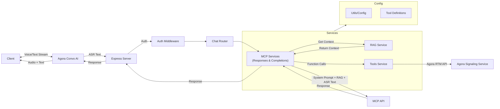
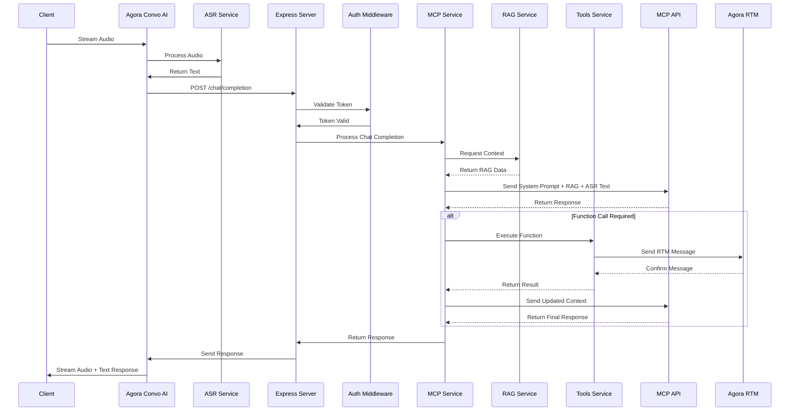
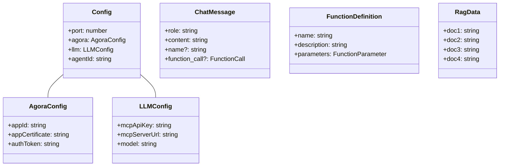

# Agora Conversational AI MCP Server

This project implements a custom LLM-powered chat service using Express.js and the Model Context Protocol (MCP) to create a custom LLM for use in the Agora Convo AI Engine. It supports both streaming and non-streaming responses, function calling capabilities, and includes RAG (Retrieval Augmented Generation) functionality.

This project implements basic tools and a tool calling mechanism. The tools use Agora Signaling Service to send messages into a real-time messaging channel.

## Architecture



For a detailed diagram of the sequence flow, see the [Sequence Flow](#sequence-flow) section, and for more information on the entities, see the [Component Details](#component-details) and [Data Models](#data-models) sections.

## Quick Deploy

[](https://heroku.com/deploy) [](https://app.netlify.com/start/deploy?repository=https://github.com/AgoraIO-Community/convo-ai-mcp-server) [](https://render.com/deploy?repo=https://github.com/AgoraIO-Community/convo-ai-mcp-server)

Each platform requires the appropriate configuration:

- Heroku: Uses the [`app.json`](./app.json) file and [`Procfile`](./Procfile)
- Netlify: Uses the [`netlify.toml`](./netlify.toml) file and the Netlify function in [`netlify/functions/api.js`](./netlify/functions/api.js)
- Render: Uses the [`render.yaml`](./render.yaml) file

## Run Locally

1. Install dependencies:

```bash
npm install
```

2. Create environment variables file:

```bash
cp env.example .env
```

3. Configure the environment variables [.env](./.env)

4. Start the server:

```bash
npm start
```

## MCP (Model Context Protocol) Integration

This server supports MCP implementations for chat completions with function calling support.

MCP provides a standardized protocol for connecting AI models with external data sources and tools, enabling enhanced context-aware responses and seamless integration with various data providers.

You can configure the MCP connection using the environment variables:

```env
# MCP Configuration
MCP_SERVER_URL=your_mcp_server_url
MCP_API_KEY=your_mcp_api_key
MCP_MODEL=your_preferred_model
```

### Build and Run with Docker

Use Docker to run this application:

```bash
# Build the Docker image
docker build -t agora-convo-ai-mcp-server .

# Run the container
docker run -p 3000:3000 --env-file .env agora-convo-ai-mcp-server
```

### Docker Compose

You can also use Docker Compose to run the application with all required services:

```bash
# Start the services
docker-compose up -d

# View logs
docker-compose logs -f

# Stop the services
docker-compose down
```

## API Endpoints

This microservice is meant to be used as a drop-in with the Agora Convo AI service. It acts as a middleware application that accepts ASR text and processes it before sending it to MCP servers.

### GET `/ping`

Returns a simple "pong" message to check the server's health.

Request:

```bash
curl http://localhost:3000/ping
```

Response:

```json
{ "message": "pong" }
```

### POST `/v1/chat/completion`

Handles chat completion requests with optional streaming support.

Request Body:

```json
{
  "messages": [{ "role": "user", "content": "Hello!" }],
  "model": "your_preferred_model",
  "stream": false,
  "channel": "default",
  "userId": "user123",
  "appId": "app123"
}
```

Example Request:

```bash
curl -X POST http://localhost:3000/v1/chat/completion \
  -H "Authorization: Bearer <your-llm-api-key>" \
  -H "Content-Type: application/json" \
  -d '{"messages": [{"role": "user", "content": "Hello!"}]}'
```

To test the llm locally we recommend using the `ngrok` tool to expose your local server to the internet.

```bash
ngrok http localhost:3000
```

This will expose your local server to the internet and you can then use the ngrok url to test the llm.

```bash
curl -X POST https://<ngrok-url>/v1/chat/completion \
  -H "Authorization: Bearer <your-llm-api-key>" \
  -H "Content-Type: application/json" \
  -d '{"messages": [{"role": "user", "content": "Hello!"}]}'
```

Response:

- Non-streaming: JSON response with completion
- Streaming: Server-sent events (SSE) with completion chunks

## Sequence Flow



## Component Details

### 1. Server ([server.ts](./src/server.ts))

- Main Express application entry point
- Configures middleware (helmet, cors, morgan, json parser)
- Mounts chat routes and health check endpoint

### 2. Chat Completion Router ([chatCompletion.ts](./src/routes/chatCompletion.ts))

- Handles POST requests to /chat/completion
- Validates request parameters
- Manages both streaming and non-streaming responses

### 3. Authentication ([auth.ts](./src/middleware/auth.ts))

- Middleware for token-based authentication
- Validates Bearer tokens against configuration

### 4. MCP Service ([mcpService.ts](./src/services/mcpService.ts))

- Core chat completion processing using MCP API
- Manages RAG integration
- Handles function calling
- Supports streaming and non-streaming modes

### 5. RAG Service ([ragService.ts](./src/services/ragService.ts))

- Provides retrieval augmented generation data
- Maintains hardcoded knowledge base
- Formats data for system prompts

### 6. Tools Service ([tools.ts](./src/services/tools.ts))

- Implements function calling capabilities
- Handles Agora RTM integration
- Provides utility functions (sendPhoto, orderSandwich)

### 7. Tool Definitions ([toolDefinitions.ts](./src/utils/toolDefinitions.ts))

- Defines available functions for LLM
- Specifies function parameters and schemas

### 8. Utils ([utils.ts](./src/utils/utils.ts))

- Manages configuration and environment variables
- Validates required settings
- Provides centralized config object

## Data Models


